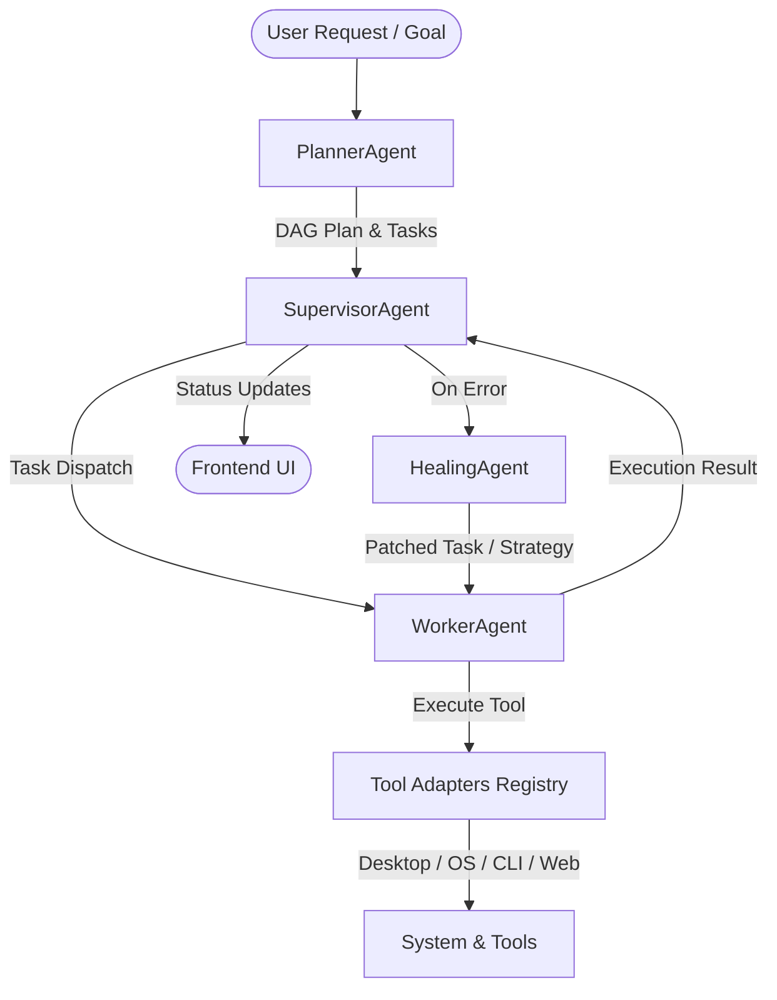

# AetherPhoenix — Agent Low-Level Architecture (LLAD)

## 1. Overview & Multi-Agent Paradigm

AetherPhoenix operates as an autonomous, event-driven, multi-agent system designed for desktop automation, code manipulation, web research, document compilation, and command execution. The architecture decouples planning, execution, supervision, self-healing, and permission management into dedicated agent contracts.

---

## 2. Core Agent Architectures

### 2.1 PlannerAgent (`app.agents.planner.agent`)
* **Role**: Primary intelligence orchestrator responsible for goal parsing, DAG decomposition, task sequencing, capability routing, and risk assessment.
* **Key Components**:
  - `GoalParser` (`app.planner.goal_parser`): Sanitizes user input, extracts structured parameters (slides count, search terms, file paths, app names).
  - `TaskDecomposer` (`app.planner.decomposer`): Generates a directed acyclic graph (DAG) of executable subtasks based on capability routing:
    * `TaskCategory.POWERSHELL` / `TERMINAL_COMMAND`: Terminal Tool (`ipconfig`, shell commands).
    * `TaskCategory.FILE_SYSTEM`: File Explorer Tool (open folders, detect files, metadata).
    * `TaskCategory.DESKTOP`: Desktop Automation Tool (VS Code, Notepad, apps).
    * `TaskCategory.PPT_GENERATION`: PPT Tool (`python-pptx` compilation).
    * `TaskCategory.GIT`: Git Tool (`status`, `log`, `branch`, `commit`).
    * `TaskCategory.BROWSER` / `WEB_RESEARCH`: Browser Tool (`Playwright`).
  - `PermissionEvaluator`: Assesses task risk levels (`CRITICAL`, `HIGH`, `MEDIUM`, `LOW`) and registers required permissions before execution.

---

### 2.2 WorkerAgent (`app.agents.worker.agent`)
* **Role**: Stateless execution engine that receives individual tasks from the `SupervisorAgent`, invokes the appropriate tool adapter from `ToolRegistry`, and returns structured `ExecutionResult` contracts.
* **Key Components**:
  - `ToolRegistry` (`app.tools.registry`): Central lookup for tool adapters (`TerminalToolAdapter`, `FileExplorerToolAdapter`, `GitToolAdapter`, `PptToolAdapter`, `BrowserToolAdapter`, `DesktopAutomationAdapter`).
  - `SafeExecutionEngine` (`app.core.sandbox`): Enforces isolated directory boundaries (`workspace/`, `artifacts/`) and execution timeouts.
  - `ExecutionMetrics`: Measures task latency (ms), exit codes, stdout/stderr streams, and resource utilization.

---

### 2.3 SupervisorAgent (`app.agents.supervisor.agent`)
* **Role**: Orchestration, state tracking, and state transition manager for active DAG workflows.
* **Key Components**:
  - `SharedWorkflowState` (`shared.contracts.workflow`): Thread-safe state container managing task statuses (`PENDING`, `RUNNING`, `COMPLETED`, `FAILED`, `RETRYING`).
  - `ParallelMonitor` (`app.engine.parallel_monitor`): Identifies independent DAG nodes eligible for parallel worker execution.
  - `ValidationPipeline`: Evaluates task output artifacts against expected contract schemas before marking nodes as `COMPLETED`.

---

### 2.4 HealingAgent (`app.agents.healing.agent`)
* **Role**: Autonomous error recovery and self-healing subsystem triggered when a task returns `TaskError` or non-zero exit codes.
* **Key Components**:
  - `ErrorClassifier`: Classifies failure root causes (e.g. `FILE_NOT_FOUND`, `PERMISSION_DENIED`, `SYNTAX_ERROR`, `TIMEOUT`).
  - `HealingPolicyEngine`: Determines if a failure is recoverable vs fatal based on retry budgets and error history.
  - `PatchGenerator`: Re-writes task inputs, alters command parameters, or suggests fallback tools (e.g., switching from direct file write to PowerShell command).

---

### 2.5 PermissionManager (`app.core.permissions.manager`)
* **Role**: Security gatekeeper enforcing human-in-the-loop (HITL) authorization for destructive or high-risk OS operations.
* **Key Components**:
  - `PermissionEvaluator`: Intercepts high-risk tool execution (`FILE_SYSTEM_WRITE`, `TERMINAL_EXECUTE`, `PROCESS_SPAWN`).
  - `ApprovalChannel`: Emits `PermissionRequest` events to the WebSocket / REST API for user authorization in the frontend modal.

---

## 3. Data Contracts & State Flow

| Component | Input Contract | Output Contract |
| :--- | :--- | :--- |
| **PlannerAgent** | `GeneratePlanRequest(goal: str)` | `PlannerPlan(tasks: List[Task], dependency_graph)` |
| **WorkerAgent** | `Task(task_id, required_tool, inputs)` | `ExecutionResult(success: bool, output, logs, metrics)` |
| **SupervisorAgent** | `WorkflowSpec` | `WorkflowState(status, active_tasks, completed_tasks)` |
| **HealingAgent** | `TaskError` + `FailedTask` | `PatchedTask` or `RecoveryStrategy` |

---

## 4. Next Expansion Plan

This document serves as the foundational low-level architecture spec inside `working/`. Sub-documents detailing individual tool adapters, message schemas, and database persistence schemas will be added in subsequent steps.
